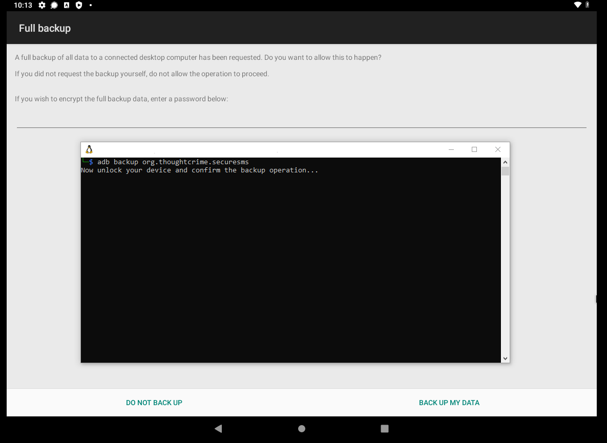
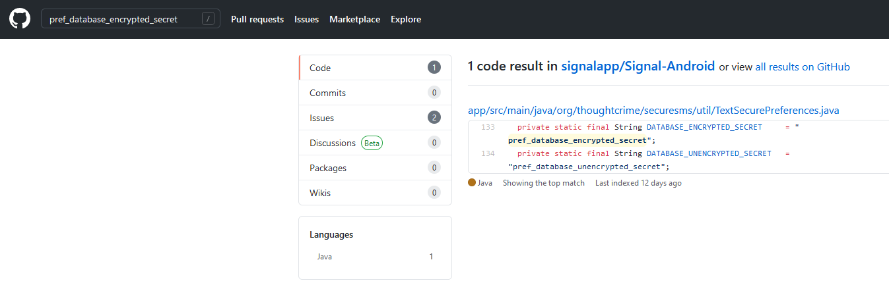
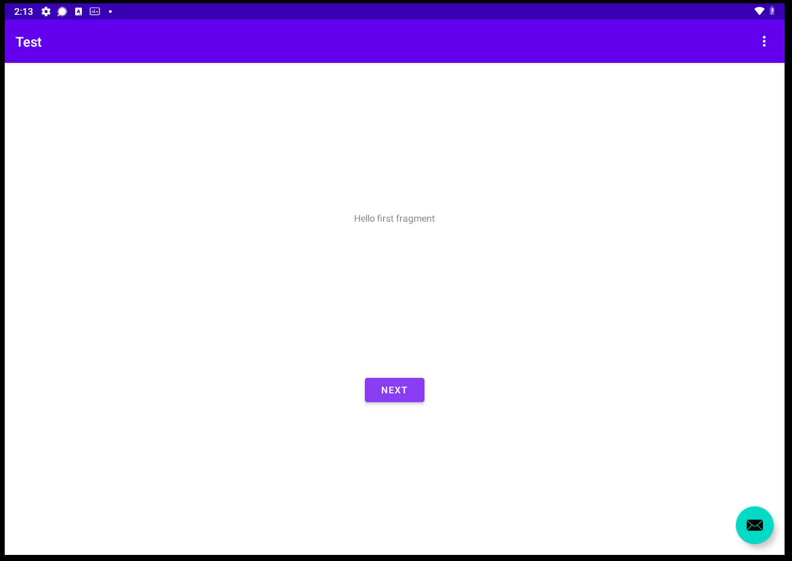
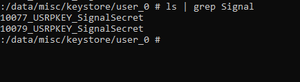
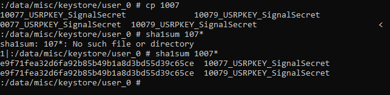
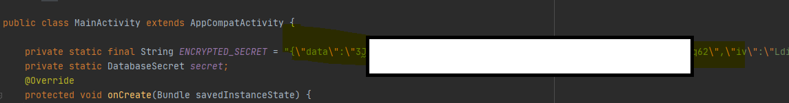
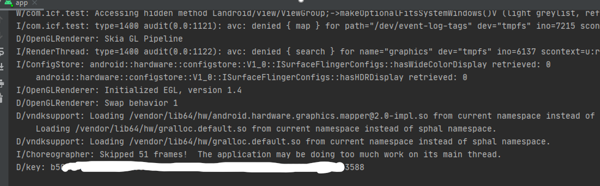
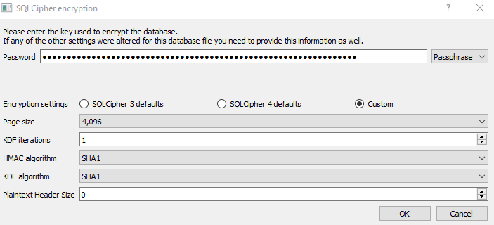
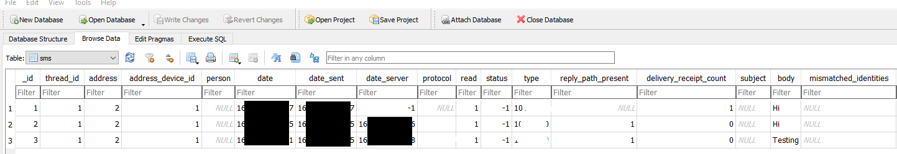

# Decrypting Signal Conversation Database
A few months ago, I was required to do forensics on the Signal (Instant Messaging App). I need to acquire and decrypt the database to access the conversation inside Signal. End-to-end encryption of Signal is almost impossible to be cracked, so, the easiest way to do forensics is to access the conversation database inside the target smartphone. I chose Android to be my target platform to do forensics. When I am so happy to try to Google it for some tutorial, almost 99% of resources found online are useless. Alternatively, if you search for iOS, tons of tutorials and resources are available. Shit.

So, I do a lot of research to understand how Signal and Android KeyStore works, and combine them together to decrypt the database. Perhaps, this blog post will be the second tutorial on how to decrypt the Signal conversation database.

# Acquiring the Signal Database
Acquiring the Signal database does not necessarily need a rooted device. In this post, I will quickly introduce two methods (including rooted and not rooted) to acquire the database.
## Without root
The Signal app is vulnerable to the downgrade attack since they didn't disable the Android backup feature in their app's manifest file in the older version. To do a downgrade attack, first, get a copy of the old version of Signal online. One possible source is from the [APKMirror](https://www.apkmirror.com/apk/signal-foundation/signal-private-messenger/textsecure-2-28-1-release/). (Please note that you are installing an unknown source APK, use it at your own risk.)
Next, use the ADB to uninstall the Signal without deleting the user database, by then, install the old APK with the upgrading option
```sh
$ adb shell pm uninstall -k org.thoughtcrime.securesms
Success
$ adb install -r org.thoughtcrime.securesms-2.28.1-156-minAPI9.apk
success
```
And now, your Android phone should have an app called "TextSecure". At this moment, you can perform the ADB backup and get a file with .ab as the extension.
```sh
$ adb backup org.thoughtcrime.securesms
Now unlock your device and confirm the backup operation...
```


Extract the Android backup (.ab) file with [Android backup extractor](https://github.com/nelenkov/android-backup-extractor)
```sh
abe unpack backup.ab backup.tar [password]
```
And you should have the conversation database now in backup.tar.

## With root
With root, everything is easy, simply start ADB in root and do an ADB pull:
```sh
$ adb root && adb pull /data/data/org.thoughtcrime.securesms
```
And you should have all files of the Signal app now.

# Decrypting the Database
Well, as Signal adopts an Android security mechanism called KeyStore, to decrypt the database you will definitely need root access (or you have a full clone of the unencrypted filesystem).

Look inside the backup you just extracted, there should be a preferences file called "org.thoughtcrime.securesms_preferences.xml". If you are lucky enough, you can easily find the decryption key for the conversation database in the preferences file (the "pref_database_unencrypted_secret" key). But most of the time, it is not that easy. The key is encrypted with a key-encryption key (KEK) which is stored securely in the Android KeyStore.

***Edit (2022/2/21): Thanks to [palebeki's effort](https://github.com/KnugiHK/KnugiHK/discussions/4#discussioncomment-2220150), we now know it is not about luck but the Android version.***

In order to decrypt the database encryption key, I traced the source code available in GitHub to learn how the KEK being retrieved.


And later I found that the key is stored in a key store named "AndroidKeyStore" and the key alias is "SignalSecret". Since the key store file is being encrypted, I found some alternatives to extract the KEK and decrypt the key. I searched online and found this [StackExchange post](https://security.stackexchange.com/a/243230). I noticed that the app can impersonate another app, therefore, I wrote a simple Android app to simulate how Signal gets KEK and decrypt the key. Source code will be available later in my GitHub repos.

***Edit (2022/02/18): The source code is now available in [KnugiHK/ExtractSignalKey](https://github.com/KnugiHK/ExtractSignalKey).***

## How the app works
The app works by first launching the app and click the NEXT button.

***Edit (2022/2/21): This method is no longer working in Android 12. See [this comments](https://github.com/KnugiHK/KnugiHK/discussions/4#discussioncomment-2220195).***



This will create a key designated for the app.



Then, I replaced the app key with Signal Key. And now, you can see, both keys 10077 and 10079 are identical.



So, what we do next is to pass the encrypted secret to the app.



Click the NEXT button in the app again, the app will do exactly what Signal does to decrypt the key since 90% of the code is copied from the Signal source code. Soon, the plaintext of the database key will now be shown in the debug console.



## Decrypting
The SQLCipher specifications of the Signal Android conversation database are different from the common defaults. After some trial and error plus some searching, I found that the specifications are as follow:
* Key format: Passphrase
* Page size: 4096
* KDF iterations: 1
* HMAC algorithm: SHA1
* KDF algorithm: SHA1
* Plaintext Header Size: 0



## And succeed!


# Conclusion
It's fun to deal with the client-side hardening measure deployed by Signal.  
*I am just too lazy to do a conclusion lol.*

# Disclaimer
This is not a standard procedure to do forensics, so, if you are an investigator, use the god damn paid tools.  

# Metadata
*[Decrypting Signal Conversation Database Comment Section](https://github.com/KnugiHK/KnugiHK/discussions/4)*
