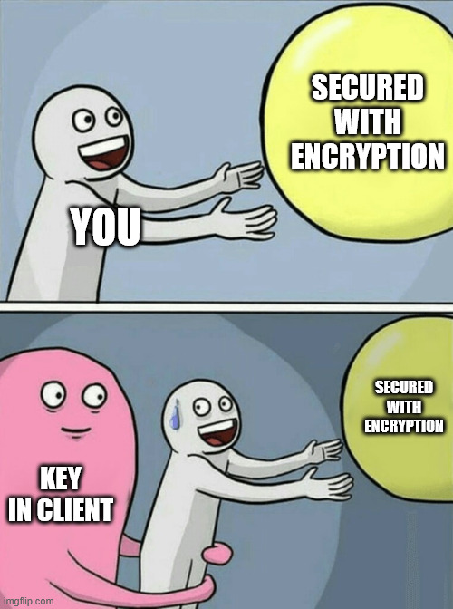
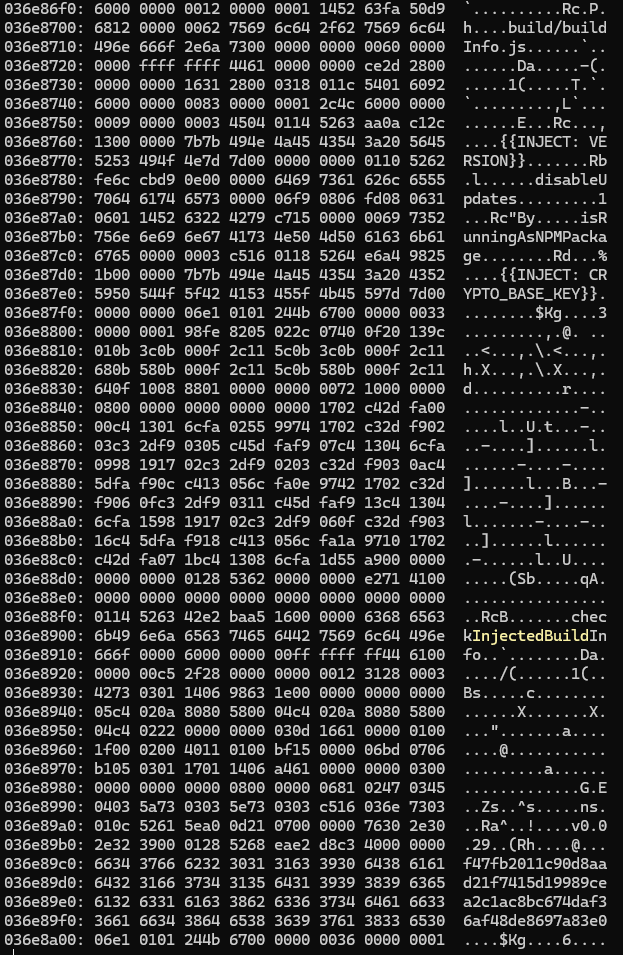
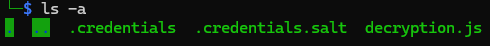
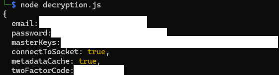

# 🔓 Cracking the Encryption Key for Filen CLI Profiles



It's been a while since my last blog post, but here we go again! A friend recently mentioned that the [Filen-CLI](https://github.com/FilenCloudDienste/filen-cli) was missing a speed indicator - a pretty essential feature for cloud drive management software. I thought, "Why not?" and quickly added one. It's already merged into the project, so check out [this PR](https://github.com/FilenCloudDienste/filen-cli/pull/240) if you're curious.

# 🧵 TL;DR
- The **Filen CLI** saves credentials encrypted using **AES-256-GCM**.
- The encryption key is derived using **PBKDF2 with SHA-512 and 600,000 iterations**, using a salt file.
- However, the **base key was embedded in the compiled binary**, meaning anyone could extract it and decrypt any credentials. 
- Filen was informed. They acknowledged it and moved the secret to be stored securely using OS-level secret stores (Keychain, Credential Manager, etc.). 
- **Lesson**: Never store secrets in client-side code. If a user (or attacker) can access the binary, they can extract the key. 
# 🕵️‍♂️ The Curiosity Kicks In

When you first run the CLI tool, it asks for your Filen credentials and whether you want to save them:

```sh
$ ./filen-cli-v0.0.29-linux-x64
Please enter your Filen credentials:
Email: [email address]
Password: ***********************************
Please enter your 2FA code or recovery key: ******
Save credentials locally for future invocations? [y/N] y
You can delete these credentials using `filen delete-credentials`
```

The credentials get saved to `~/.config/filen-cli/.credentials`, along with a `.credentials.salt` file. If you open `.credentials`, all you see is a bunch of hex values, nothing readable. That, plus the `.salt` file, strongly suggests encryption. As a normal user, I wouldn't have thought much of it... But as a developer, things got interesting when I ran into a build error:

```sh
$ npm run build
Error: ENOENT: no such file or directory, open 'key'
```

Wait... What? There's a missing key file? Okay, let's dig deeper.

# 🧩 Reverse-Engineering the Decryption Process

By checking out [`injectBuildInfo.mjs` file](https://github.com/FilenCloudDienste/filen-cli/blob/afd20068e51aa93dfe6bee25fa5a6d8e49fd857b/injectBuildInfo.mjs#L8C25-L8C51), I found that the "key" is either pulled from an environment variable or read from a file named "key". Official Filen CLI builds use GitHub Actions, which store `FILEN_CLI_CRYPTO_BASE_KEY` as a secret, so there's no direct way to retrieve it.

## 🔐 Breaking Down the Encryption
Looking at `filen-cli/src/auth/credentialsCrypto.ts`, I found out how the credentials file is encrypted:

1. Key Derivation: The `.credentials.salt` file is used to derive the encryption key using PBKDF2 (SHA-512, 600,000 iterations).

```js
private deriveEncryptionKey(): Promise<Buffer> {
    return new Promise((resolve, reject) => {
        crypto.pbkdf2(this.key, this.salt, 600_000, 256 / 8, "sha512", (err, derivedKey) => {
            if (err) reject(err);
            else resolve(derivedKey);
        });
    });
}
```

2. Encryption: The encryption method is AES-256-GCM, with a 12-byte IV. The final encrypted output includes the IV, ciphertext, and authentication tag.

```js
public async encrypt(credentials: FilenSDKConfig): Promise<string> {
    const derivedKey = await this.deriveEncryptionKey();
    const iv = crypto.randomBytes(12);
    const cipher = crypto.createCipheriv("aes-256-gcm", derivedKey, iv);
    const encrypted = Buffer.concat([cipher.update(JSON.stringify(credentials)), cipher.final()]);
    const authTag = cipher.getAuthTag();
    return Buffer.concat([iv, encrypted, authTag]).toString("hex");
}
```

1. The "Secret" Key: The key is injected at build time from `filen-cli/src/buildinfo.ts`:

```js
export const key: string = "{{INJECT: CRYPTO_BASE_KEY}}"
```

Alright, so the encryption is strong, but the key is stored somewhere inside the compiled binary. Time to go hunting.
# 🧨 Extracting the Key from the Binary

## 🪓 Brute-force
Given the above observation, we can safely say that the key must be inside the official binaries Since the source file indicated that the "key" is a string and the key is 32 bytes. Since 32 bytes is equal to 64 hexadecimal characters, I ran:

```
$ strings filen-cli-v0.0.29-linux-x64 | egrep -i '^[0-9a-f]{64}$'
```

This gave me 359 potential hits. Brute-forcing all of them is doable, but let's take a smarter approach.
## 🧬 Binary Analysis
I searched the binary for references to `buildInfo.ts` and found this section:



See that 64-character hex string at the end? Given the surrounding context, it looks like the decryption key!
# 🧪 Decrypting the Credentials
With the key in hand, I recreated the decryption process by reusing some code from `credentialsCrypto.ts`:

```js
const path = require('path');
const fsModule = require('fs');
const crypto = require('crypto');

const key = "f47fb2011c90d8aad21f7415d19989cea2c1ac8bc674daf36af48de8697a83e0"
const saltFile = path.join(".credentials.salt")
const salt = fsModule.readFileSync(saltFile).toString()

async function deriveEncryptionKey() {
	return new Promise((resolve, reject) => {
		crypto.pbkdf2(key, salt, 600_000, 256 / 8, "sha512", (err, derivedKey) => {
			if (err) reject(err)
			else resolve(derivedKey)
		})
	})
}

async function decrypt(encrypted) {
	const derivedKey = await deriveEncryptionKey()
	const data = Buffer.from(encrypted, "hex")
	const iv = data.subarray(0, 12)
	const encData = data.subarray(12)
	const authTag = encData.subarray(-16)
	const ciphertext = encData.subarray(0, encData.byteLength - 16)
	const decipher = crypto.createDecipheriv("aes-256-gcm", derivedKey, iv)
	decipher.setAuthTag(authTag)
	const decrypted = Buffer.concat([decipher.update(ciphertext), decipher.final()]).toString("utf-8")
	return JSON.parse(decrypted)
}

(async () => {
	const encryptedConfig = await fsModule.promises.readFile(".credentials", { encoding: "utf-8" })
	const config = await decrypt(encryptedConfig);
	console.log(config);
})();
```

Then, put all the files together.



And boom! The decrypted credentials appear:

# 💥 And boom!
The decrypted credentials file appear:


So, yeah. It turns out the encryption was basically pointless since the key was right there in the binary all along

# 📢 Disclosure
I reported this issue to Filen back in December, and they acknowledged it. Their solution? Moving the encryption key to a local secret store like Credential Manager or Keychain. Interestingly, this change had already been implemented before I reported it and was included in the [v0.0.31](https://github.com/FilenCloudDienste/filen-cli/releases/tag/v0.0.31) release three months later.

### 📅 Timeline
- 28 Dec 2024 - New way to store the secret is introduced ([b8d1223](https://github.com/FilenCloudDienste/filen-cli/commit/b8d1223368d3e9b88894a285ca23df7733d18e11))
- 30 Dec 2024 - Issue reported to vendor
- 30 Dec 2024 - Issue acknowledged by vendor (several minutes later, speed of light!)
- 22 Mar 2025 - Proper fix released in v0.0.31
# 🎓 Security 101
Any secret embedded in client-side code, binaries, frontends, mobile apps, or browser extensions is **not** a secret. Obfuscation is not encryption, and even encryption is just a speed bump if the key is nearby. Even Digital Rights Management (DRM) can be bypassed — so never trust client-side binaries to securely "hide" secrets.

✅ **Instead:** To securely access and store secrets locally, fetch them at runtime through a secure channel, and store them using OS-level secure storage (such as Keychain, Credential Manager, or GNOME Keyring).

🧠 Always keep this in mind:  
**If it runs on the client, it's already compromised.**

Stay safe out there!